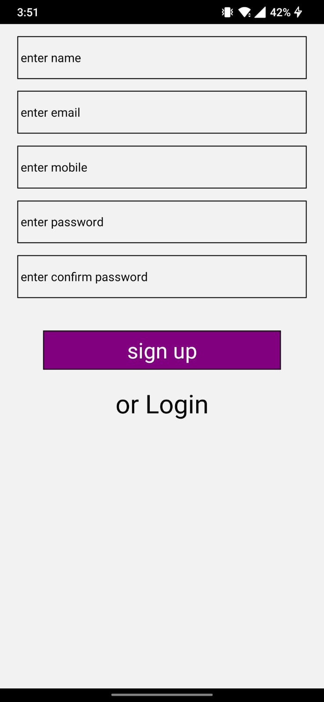
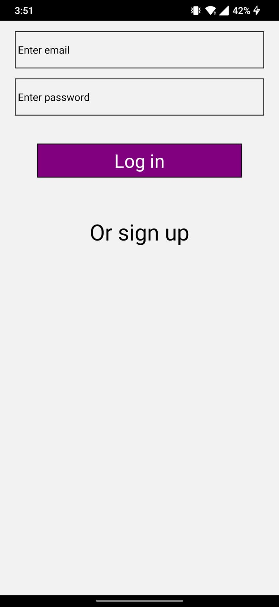
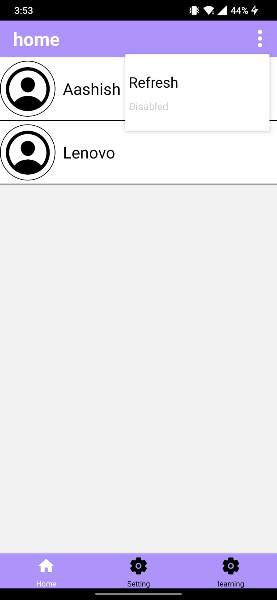
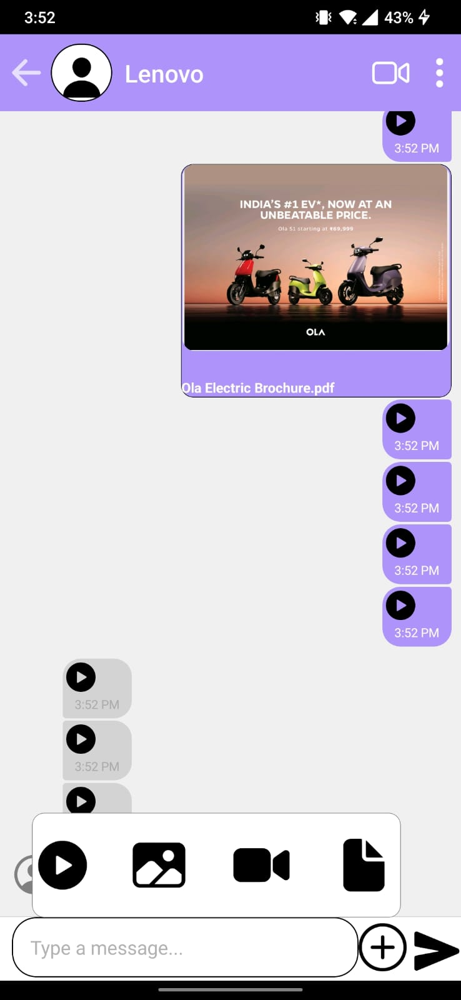
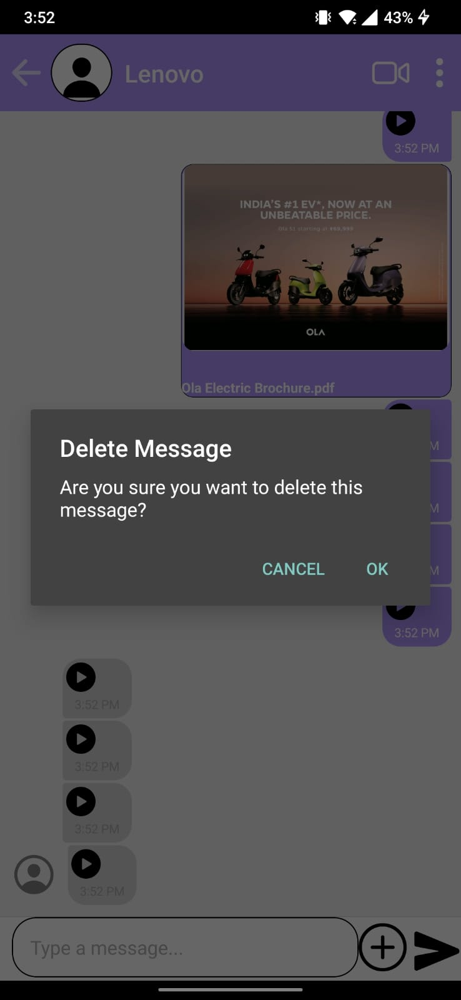
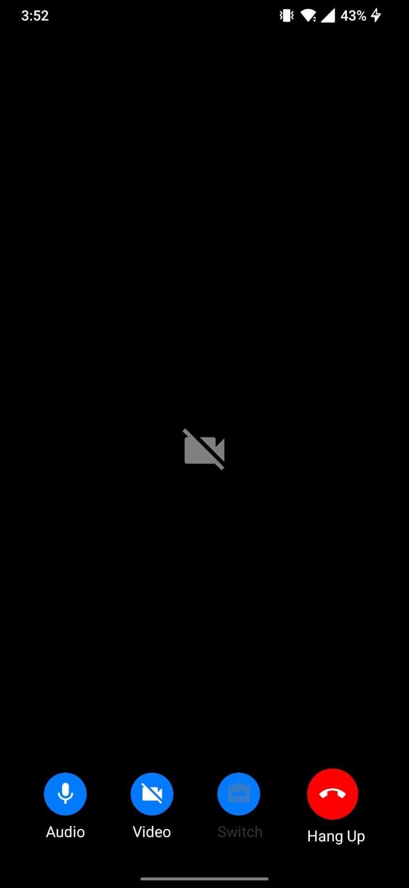

# React Native Chat Messaging App
This React Native application is a real-time chat messaging app that allows users to sign up, log in, and engage in live chat conversations. It integrates with Firebase Firestore for data storage and real-time communication. Additionally, users can send text messages, documents, images, videos, and initiate video calls with other users.

# Features
* User Authentication: Users can sign up and log in securely to access the chat features.
* Real-time Messaging: Utilizes Firebase Firestore to enable real-time messaging between users.
* Message Types: Supports various types of messages including text, documents, images, and videos.
* Video Calling: Allows users to initiate video calls with other users within the app.
* Redux Integration: Utilizes Redux for state management, providing a predictable state container for the application.
* Technologies Used
* React Native
* Firebase Firestore
* Redux
* React Navigation
 
# Usage
* Sign up for an account using the provided registration form.
* Log in to access the chat messaging features.
* Start a new conversation or join existing ones to chat with other users.
* Send text messages, documents, images, or videos by selecting the appropriate options in the chat interface.
* Initiate video calls with other users by selecting the video call option in the chat interface.
* Contributing
* Contributions are welcome! Feel free to open issues or pull requests to suggest improvements, report bugs, or add new features.

      
       